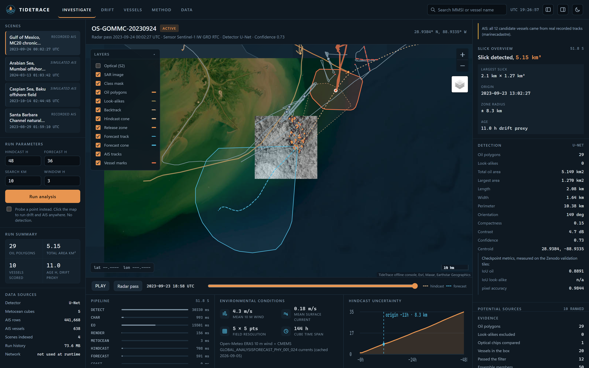
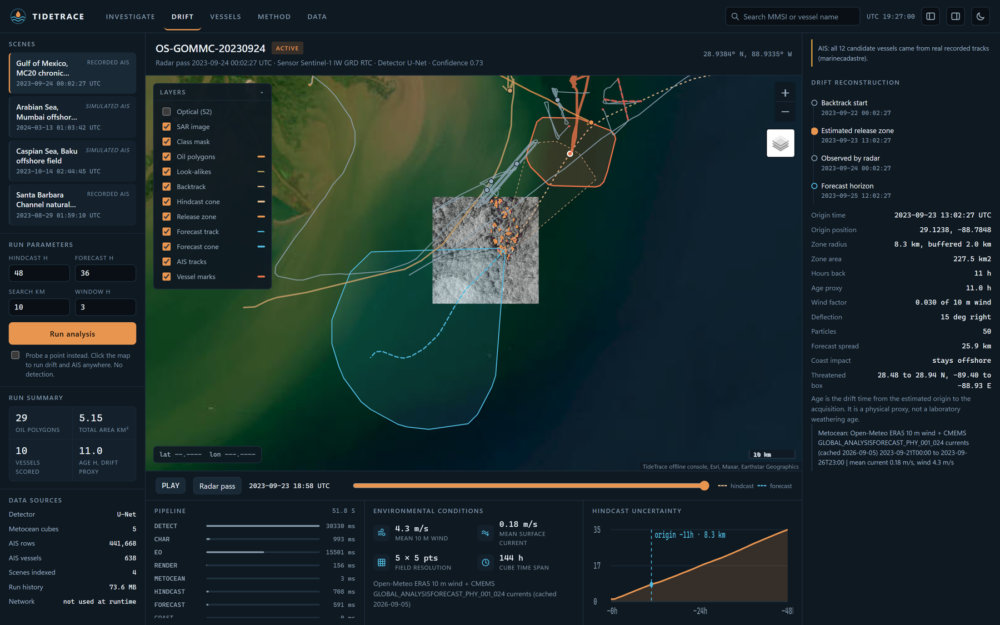
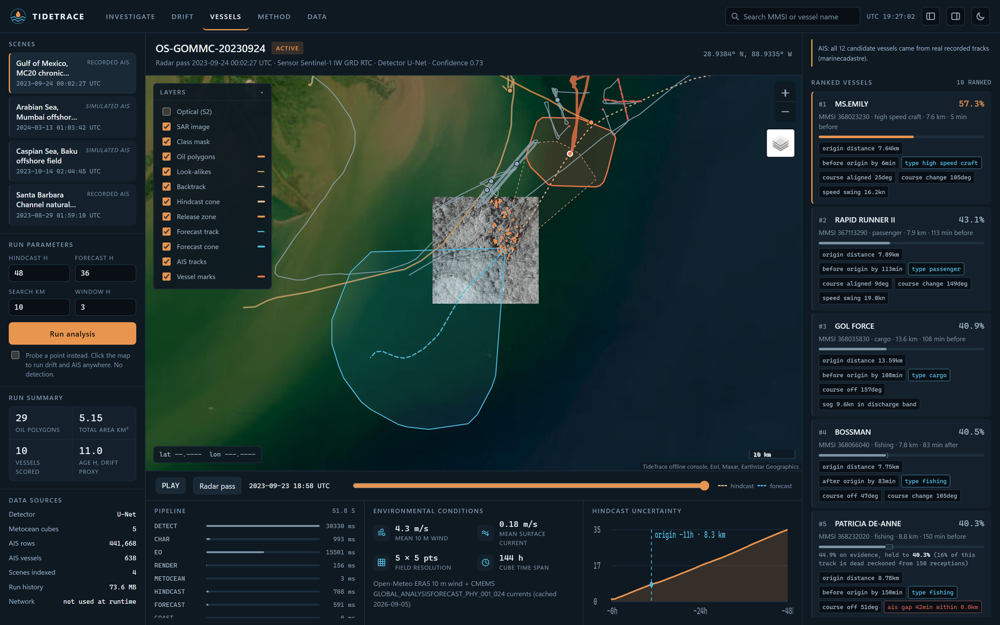
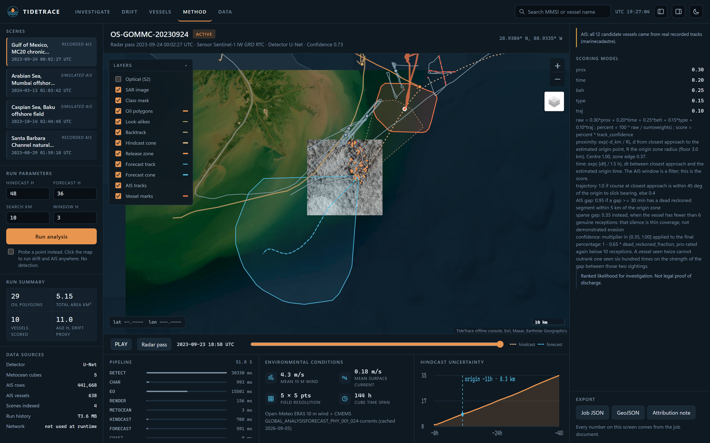
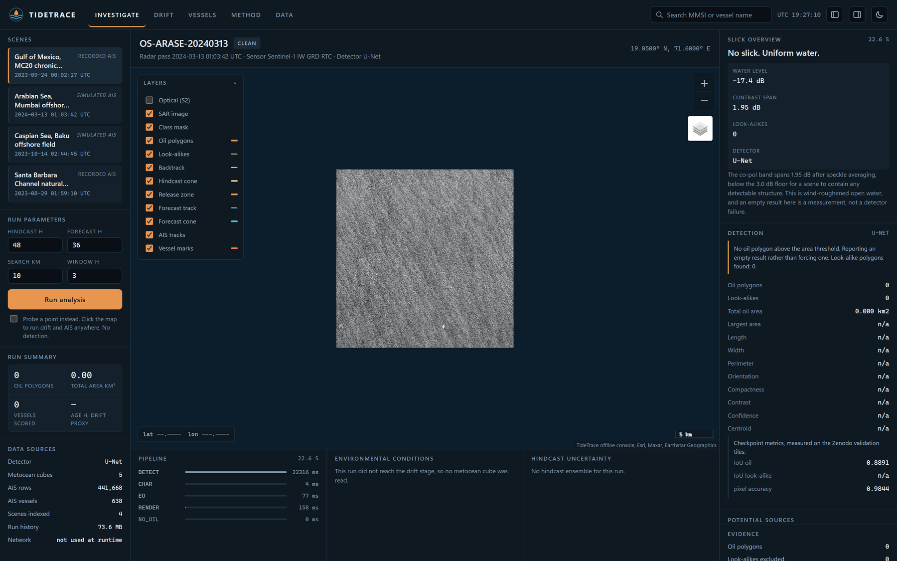
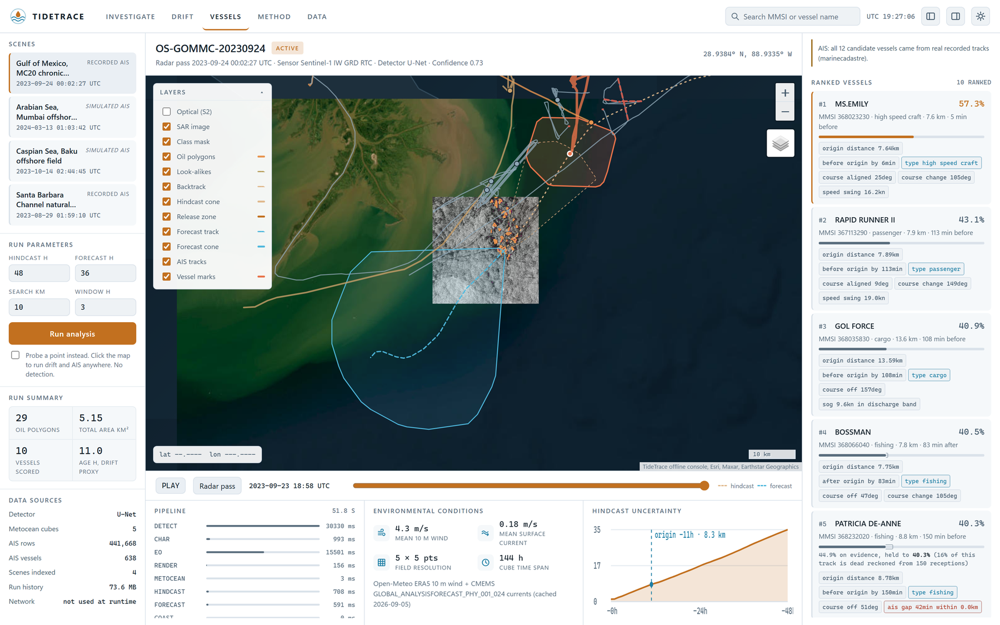

# TideTrace

**NTRO Oil Spill Attribution Console**

`SIH26143` · National Technical Research Organisation · Software · Theme: Disaster Management / Space Technology

TideTrace finds oil slicks in Sentinel-1 SAR imagery, runs the drift physics
backwards through real cached wind and current fields to estimate where and when
the oil was released, projects where it goes next, pulls the AIS traffic that
was around that origin, and ranks the vessels most worth investigating with the
reasons attached.

The whole thing runs on one laptop with the network unplugged. No Docker, no
cloud service, no login at run time, no CUDA requirement.

```
126 tests passing  ·  IoU_oil 0.889 on the Zenodo validation tiles  ·  full run 30 to 45 s on CPU
```

---

## Contents

- [The console](#the-console)
- [The problem statement](#the-problem-statement)
- [How TideTrace answers it](#how-tidetrace-answers-it)
- [Architecture](#architecture)
- [Tech stack](#tech-stack)
- [Quick start](#quick-start)
- [Datasets](#datasets)
- [The detector, measured](#the-detector-measured)
- [The physics](#the-physics)
- [The scoring](#the-scoring)
- [Module map](#module-map)
- [API](#api)
- [Tests](#tests)
- [Configuration](#configuration)
- [Limitations](#limitations)
- [Training](#training)

---

## The console

Three rails over one run. The left rail picks the scene and holds the run
parameters, the centre is the chart plus the time axis and the three cards that
say how the run went, and the right rail is the evidence. The header switches
the right rail between five views of the same job document: Investigate, Drift,
Vessels, Method and Data.

### Investigate

Detection, drift and forecast on one chart, with the slick geometry and the
checkpoint metrics beside it.



### Drift

The backward ensemble, the release zone it converged on, and the metocean fields
that were actually integrated, printed with their source and cache date.



### Vessels

The ranked leaderboard. Every entry carries its reason codes, and the score bar
runs solid to the ranked score then continues as a hairline to where the
evidence alone would have placed the vessel. The gap is how much of the case
rests on dead reckoning rather than received positions.



### Method

Weights, formulas and priors, served from `/api/scoring` and rendered on the
page, so the ranking can be argued with rather than trusted.



### A clean scene is a finding

The Arabian Sea chip is uniform wind-roughened water. Its co-pol band spans
1.95 dB after speckle averaging against 7.0 dB on the Gulf chip. Both detectors
correctly return nothing, and the console reports that as a measurement instead
of an empty panel.



### Light theme

Both themes are measured rather than eyeballed: every text colour clears 4.5:1
against its own background. The chart stays dark in both, because inverting
imagery makes a slick harder to read.



---

## The problem statement

> **26143.** Leveraging satellite imagery to determine oil spills at sea along
> with AIS data correlations to identify the vessel responsible for the spill.

Marine oil spills damage ecosystems and often stay unattributed to the vessel
that caused them. The core challenge is to detect a spill from remote sensing
data (SAR and EO imagery) and identify the polluting vessel from AIS. The
pipeline is asked to:

- **(a)** detect and characterise the oil spill, calculating geometric
  properties and age if feasible;
- **(b)** use oceanographic and meteorological data to trace the slick back to
  its origin point and time, and predict the future flow of the slick;
- **(c)** attribute the spill to a vessel using historic AIS data to reconstruct
  vessel traffic around the origin window in space and time, filter out
  irrelevant traffic, and score suspect vessels on proximity, trajectory and
  behavioural aspects.

---

## How TideTrace answers it

| Clause | What TideTrace does | Where it lives | What you see |
| --- | --- | --- | --- |
| (a) Detect oil in SAR | UNet++ over 512 px tiles of a 2048 px dual-pol chip, cosine-tapered stitching | `app/ml/infer.py` | Orange polygons on the chart |
| (a) Reject look-alikes | Separate class, drawn and then excluded from attribution | `app/ml/fallback.py` | Yellow dashed polygons. Baseline path only, see [limitations](#limitations) |
| (a) Say when a scene is clean | Scene radiometry: contrast span against a measured floor | `app/ml/infer.py` `scene_radiometry` | "No slick. Uniform water." with the measured span |
| (a) Geometric characterisation | Local azimuthal equidistant frame, then contours | `app/geo/geometry.py` | Area, length, width, perimeter, orientation, compactness, centroid, bbox |
| (a) Age, if feasible | Hours between the estimated origin and the radar pass | `app/pipeline.py` | Labelled a drift proxy, not a weathering age |
| (a) EO corroboration | Sentinel-2 chip compared against the SAR footprint | `app/eo/corroborate.py` | Optional optical layer, count in the evidence rail |
| (b) Oceanographic and meteorological data | Cached ERA5 10 m wind and CMEMS surface currents, bilinear in space, linear in time | `app/drift/fields.py` | Field source, resolution and cube time span, printed |
| (b) Trace to origin point and time | RK2 Lagrangian ensemble run backwards, 50 particles | `app/drift/advection.py` | Backtrack path, release zone with a stated radius |
| (b) Predict future flow | Same integrator forwards, percentile envelope | `app/drift/cone.py` | Forecast cone, threatened box, coast impact flag |
| (c) Historic AIS reconstruction | MarineCadastre schema into SQLite, resampled to one minute, gaps preserved | `app/ais/ingest.py`, `interpolate.py` | Tracks on the chart, scrubbable on the time axis |
| (c) Filter irrelevant traffic | Spatio-temporal funnel around the origin zone and window | `app/ais/filter.py` | Funnel counts in the evidence rail |
| (c) Score proximity, trajectory, behaviour | Five sub-scores, weighted, plus a track confidence multiplier | `app/ais/score.py` | Leaderboard with reason codes |
| Suitable visual interface | Vanilla HTML and vendored Leaflet, no build step | `app/static/` | The three-rail console above |

---

## Architecture

Two diagrams. The first is about trust, the second about mechanism. Both are
also in [docs/ARCHITECTURE.md](docs/ARCHITECTURE.md).

### The offline boundary


Network access exists only in the preparation lane. Everything under `scripts/`
may dial out, and it runs once, before judging. Everything under `app/` reads
files. `data/` is the interface between the two.

That is not a convention anyone has to remember. It is asserted twice:

- `tests/test_pipeline_offline.py` blocks every outbound socket, `getaddrinfo`
  call and `urlopen`, then drives `POST /api/run` to completion.
- `tests/test_offline_boundary.py` parses every module under `app/` and fails if
  one imports a network client, then imports `app.main` and fails if any network
  client has reached `sys.modules`.

### What one button does


```
SAR chip (VV/VH GeoTIFF)
      |
      v
 DETECT   UNet++ segmentation, or the dB baseline if no checkpoint
      |   -> oil polygons, look-alike polygons
      v
 CHAR     local AEQD frame, contours, PCA orientation
      |   -> area, length, width, perimeter, orientation, centroid
      v
 EO       Sentinel-2 chip corroboration where a chip exists
      v
 METOCEAN cached ERA5 wind + CMEMS currents for this footprint and hour
      v
 HINDCAST RK2 backward ensemble, 50 particles seeded inside the slick
      |   -> release zone polygon, origin time, zone radius
      v
 FORECAST same integrator forwards
      |   -> dispersion cone, threatened box, coast impact
      v
 AGE      hours from origin to radar pass, labelled a drift proxy
      v
 AIS      SQLite query on the origin box and window, resampled to 1 min
      v
 FILTER   spatio-temporal funnel
      v
 SCORE    five sub-scores, weights, track confidence
          -> ranked leaderboard with reason codes
```

Each stage is timed and written into `data/jobs/<id>.json`. The console reads
that document and nothing else, which is why every number on the screen can be
exported with the Job JSON button.

---

## Tech stack

| Layer | Choice | Why |
| --- | --- | --- |
| Runtime | Python 3.11+ | Only hard floor is `pydantic` v2 and modern typing |
| API | FastAPI + uvicorn | Async job handling, automatic schema, no framework weight |
| Validation | pydantic v2 | Request and response models in `app/schemas.py` |
| Numerics | numpy | The only mandatory scientific dependency |
| Segmentation | PyTorch + segmentation-models-pytorch (UnetPlusPlus, `timm-efficientnet-b0`) | Loaded lazily and CPU only on the demo laptop |
| Raster IO | rasterio, with a builtin TIFF reader as fallback | `app/geo/tiffio.py` handles uncompressed and Deflate TIFFs so rasterio stays optional |
| Projection | pyproj, with spherical formulas as fallback | Local azimuthal equidistant frames in `app/geo/crs.py` |
| Morphology | scipy, with numpy equivalents as fallback | Connected components, speckle filter |
| Geometry | hand-written in `app/geo/geometry.py` | shapely is genuinely optional |
| Job store | JSON documents on disk, bounded retention | `app/jobs/store.py`, no database to install |
| AIS store | SQLite, MarineCadastre column schema | Indexed on time and position |
| Frontend | vanilla HTML, CSS and JS, vendored Leaflet 1.9 | No build tooling, no CDN, no framework |
| Reporting | HTML always, PDF via reportlab if installed | The attribution note never depends on an optional package |
| Training | Kaggle P100/T4 notebooks, Hugging Face Hub for artefacts | The laptop pulls back one file under 80 MB |

Everything outside the required block in [requirements.txt](requirements.txt) is
genuinely optional. The app starts, serves the console and runs the full
pipeline without any of it, and states in the Data view what it lost.

---

## Quick start

```bash
git clone https://github.com/S-T-A-RNalin1/tidetrace.git
cd tidetrace
python -m venv .venv
```

```bash
.venv\Scripts\activate          # Windows
source .venv/bin/activate       # Linux and macOS
```

```bash
python -m pip install -r requirements.txt
```

Fetch the demo data once, while online:

```bash
python scripts/bootstrap_demo.py
```

Then serve the console:

```bash
python -m uvicorn app.main:app --host 127.0.0.1 --port 8000
```

Open <http://127.0.0.1:8000>, pick a scene in the left rail, press **Run
analysis**. A full run takes 30 to 45 seconds on a laptop CPU and the overlay
names the step it is in. A clean scene skips drift and AIS and finishes in
about 12.

Once `bootstrap_demo.py` has run you can disconnect the network. Everything
still works, which is the point.

### What bootstrap does

1. Vendors Leaflet 1.9 into `app/static/vendor/leaflet` so the browser needs no CDN.
2. Fetches real Sentinel-1 chips, screening several acquisitions per site and
   keeping the one where a slick is actually visible.
3. Caches real ERA5 wind and marine currents for each scene footprint.
4. Simulates AIS traffic for scenes outside public AIS coverage. Scenes inside
   coverage are skipped, with instructions to fetch the real thing.
5. Caches a coastline (`scripts/build_land_mask.py`) so the forecast can report
   whether the cone reaches land.
6. Caches a simplified world coastline (`scripts/fetch_world_land.py`, 724 KB
   for both levels of detail) so the chart is a map at every zoom rather than
   four imagery patches in an empty wash.

### Optional: the trained checkpoint

Without `models/oil_unet_best.pt` the app runs the dB baseline and says so in
the case header. To pull the trained model:

```bash
python scripts/hf_sync.py pull-model
```

### Sharing a run

A finished run is a case, and a case is linkable:

```
http://127.0.0.1:8000/#job=<job_id>&view=vessels
```

The fragment reopens a stored job at a given view without recomputing it.

---

## Datasets

| Source | Used for | Licence | Login? | Used at demo time? |
| --- | --- | --- | --- | --- |
| Zenodo Sentinel-1 SAR oil spill dataset, Parts I / II / III (`10.5281/zenodo.8346860`, `.8253899`, `.13761290`) | UNet++ training and the IoU table | CC BY 4.0 | No | No. Training only, on Kaggle |
| Sentinel-1 IW GRD RTC via Microsoft Planetary Computer | Demo scene chips | Contains modified Copernicus Sentinel data; CC BY 4.0 | No | No. Cut once, then read from disk |
| Sentinel-2 L2A via Microsoft Planetary Computer | Optical corroboration chips | Contains modified Copernicus Sentinel data; CC BY 4.0 | No | No. Cached |
| Open-Meteo Archive API (ERA5 10 m wind) | Clause (b) wind field | CC BY 4.0, free for non-commercial use | No | No. Cached to `data/metocean/*.npz` |
| Copernicus Marine Service, `GLOBAL_ANALYSISFORECAST_PHY_001_024` | Clause (b) current field | E.U. Copernicus Marine Service Information, attribution required | No, the cubes ship pre-cut | No. Cached |
| Open-Meteo Marine API | Clause (b) currents where CMEMS has no coverage | CC BY 4.0, free for non-commercial use | No | No. Cached |
| [MarineCadastre.gov AIS](https://marinecadastre.gov/accessais/) | Clause (c), real vessel tracks in US waters | US Government work, public domain | No | No. Clipped to the scene box, then the national file is deleted |
| Natural Earth 1:10m land | Coast impact flag on the forecast cone | Public domain | No | No. Clipped to the scene footprints, 75 KB |
| Natural Earth 1:110m and 1:50m land | Continents on the chart base at every zoom | Public domain | No | No. Simplified once to 79 KB and 645 KB |
| Simulated traffic (`app/ais/synthetic.py`) | Clause (c) where no public AIS exists | n/a | n/a | Yes, written in MarineCadastre columns |

ECMWF CDS and NASA Earthdata are deliberately not used. Both need accounts, and
the problem statement never asked for a live vendor API.

### The four demo scenes

| Scene | Radar pass | AIS |
| --- | --- | --- |
| Gulf of Mexico, MC20 chronic discharge site | 2023-09-24 00:02 UTC | Real, MarineCadastre |
| Santa Barbara Channel natural seeps | 2023-08-29 01:59 UTC | Real, MarineCadastre |
| Arabian Sea, Mumbai offshore approaches | 2024-03-13 01:03 UTC | Simulated |
| Caspian Sea, Baku offshore field | 2023-10-14 02:44 UTC | Simulated |

`data/sar/scenes.json` records which is which in the `ais_mode` field, and the
console prints it on every scene card, so a simulated track is never presented
as a received one.

---

## The detector, measured

Trained on Kaggle for 40 epochs over 1,164 tiles, best epoch 33. Measured on the
held-out Zenodo validation tiles, next to the dB baseline on the same tiles:

| Metric | UNet++ checkpoint | dB baseline |
| --- | --- | --- |
| IoU oil | **0.8891** | 0.0000 |
| IoU sea | 0.9822 | 0.8645 |
| mIoU | 0.9356 | 0.2882 |
| Pixel accuracy | 0.9844 | 0.8645 |
| Water called oil | 0.0106 | 0.0038 |

The baseline exists so that clauses (a), (b) and (c) still run with no
checkpoint and no GPU. It is an availability guarantee, not a measurement, and
the console names `dB baseline` in the case header whenever it is what ran.

Training saves the best `iou_oil` only if `water_false_oil <= 0.02`. IoU_oil
alone is monotone in "predict more oil" when measured on tiles selected for
containing oil, so on its own it cannot see a model that has stopped finding
water. An earlier checkpoint scored IoU_oil 0.857 and then called every pixel of
the ocean oil; it is kept in `models/quarantine/` with its report as the reason
the gate exists. See [docs/COMPLIANCE.md](docs/COMPLIANCE.md).

---

## The physics

Surface drift, with Stokes drift switched off:

```
V = U_current + 0.03 * U_wind10
```

0.03 is the wind factor OpenDrift's maintainers quote when Stokes drift is not
being double counted. An optional 15 degree leeway deflection rotates the wind
term to the right in the northern hemisphere.

Integration is RK2 with a one hour step, in a local azimuthal equidistant frame
recentred on the ensemble every step. The backward run is the same integrator
with a negative step, which is what makes the hindcast honest: it is the forward
physics reversed, not a separate heuristic.

Fifty particles are seeded inside the slick polygon by rejection sampling, so
the initial cloud has the shape of the real slick. Each carries a fixed velocity
perturbation drawn once (0.1 m/s on current, 1 m/s on wind), which is how you
get a drift cone rather than a random walk that averages itself away.

**Origin rule, frozen.** Walk the backward run and take the first hour where the
90 percent ensemble spread radius exceeds 8 km, clipped to 6 to 48 hours. That
is the point where the physics stops being informative and the case has to be
handed to AIS. The full track is returned as well, so the path stays visible.

OpenDrift is not a runtime dependency. It is GPL and heavy, and the demo has to
install on a laptop in minutes. If it happens to be importable it can be used
for a comparison overlay; it is never required.

---

## The scoring

```
S_proximity  = exp(-d_km / R)            d from the closest approach to the
                                         estimated ORIGIN POINT, R the origin
                                         zone radius. Centre 1.00, zone edge
                                         0.37, twice the radius 0.13
S_time       = exp(-|dt| / 1.5 h)        dt between the closest approach and
                                         the estimated origin TIME
S_trajectory = 1.0 if the course at closest approach is within 45 degrees of the
               origin-to-slick bearing, else 0.4
S_type       = published prior for the decoded AIS vessel type
               crude oil tanker 1.00, chemical tanker 0.90, tanker 0.85,
               bulk cargo 0.55, cargo 0.50, container 0.45, fishing 0.20,
               passenger 0.05, unknown 0.30
S_behavior   = max of
               0.70  operational discharge: 8 to 16 kn at closest approach
               0.60  course change: spread above 30 degrees within 20 minutes
               0.50  speed swing above 5 kn in the same window
               0.95  AIS gap of 30 minutes or more whose dead reckoned segment
                     passes within 5 km of the origin zone
               0.35  the same gap, on a vessel with fewer than 6 genuine
                     receptions: that silence is thin coverage, not evasion
               0.10  baseline

raw        = 0.30*prox + 0.20*time + 0.25*beh + 0.15*type + 0.10*traj
percent    = 100 * raw / sum(weights)
confidence = clamp(1 - 0.65 * dead_reckoned_fraction, 0.35, 1.0),
             pro-rated again below 10 receptions
score      = percent * confidence
```

Three of those lines are corrections, and it is worth saying what they fix.

**Proximity is measured to the origin point, not to the zone boundary.** It used
to decay on distance to the boundary and clamp to zero inside. An origin zone is
routinely 200 km2 and every candidate crosses one somewhere in a six hour
window, so every candidate scored exactly 1.0 and the heaviest weight in the
model carried no information. On the Gulf scene, 8 of 10 suspects were pinned at
`prox = 1.00`.

**Time is scored, not merely filtered.** The problem statement asks for
spatio-temporal correlation. A plus or minus three hour window with no temporal
term treats a vessel present three hours early exactly like one sitting on the
origin at the origin minute.

**A track that was mostly assumed cannot outrank one that was observed.** The
AIS gap flag pays the highest behaviour score, so before the confidence term the
top suspect on the Gulf scene was a fishing boat with two AIS receptions whose
track was 99.4 percent dead reckoning, and the gap that reckoning spanned was
the entire case against it. Three vessels tied at 73.8 percent, which is not a
ranking. Confidence is reported next to the score and drawn as the ghost tail on
each bar, so the analyst sees the case and the evidence it rests on as two
separate numbers.

The percentage is absolute, never min-max normalised across the batch. A
relative scale would hand the top slot to somebody on every scene, including a
clean one. On a scene with no plausible suspect the leaderboard is empty and
says so.

---

## Module map

```
app/
  main.py            FastAPI app, static mount, CORS
  config.py          frozen constants; every one is overridable by env var
  schemas.py         pydantic v2 request and response models
  pipeline.py        the one button: DETECT -> CHAR -> EO -> METOCEAN
                     -> HINDCAST -> FORECAST -> AGE -> AIS -> FILTER -> SCORE
  scenes.py          scene registry; decides real vs simulated AIS by geography
  api/               detect, drift, ais, pipeline, health, report routes
  ml/
    infer.py         tiled inference, cosine-tapered stitching, model or baseline;
                     locked one-shot checkpoint load, scene radiometry
    fallback.py      multi-looked dark patch baseline, oil vs look-alike split
    model.py         UNet++ builder and checkpoint IO; imports torch lazily
    dataset.py       Zenodo tiling and 3-class relabelling
    train.py         Kaggle training entry point
  geo/
    raster.py        GeoTIFF IO; forces SAR georeference onto bare masks
    tiffio.py        builtin TIFF reader and writer, so rasterio stays optional
    geometry.py      contours, area, length, orientation, hulls, buffers
    crs.py           local azimuthal equidistant frames, haversine, bearings
  drift/
    fields.py        cached metocean cubes, bilinear in space, linear in time
    advection.py     RK2 Lagrangian ensemble, forward and backward
    cone.py          percentile envelopes, origin zone, swept cones
    land.py          coastline raster, coast impact flag
  eo/corroborate.py  Sentinel-2 chip comparison against the SAR footprint
  ais/
    ingest.py        MarineCadastre CSV to SQLite, exact column schema
    interpolate.py   resampling, gap detection, dead reckoning flags
    filter.py        spatio-temporal funnel
    score.py         five sub-scores, track confidence, reason codes
    synthetic.py     traffic simulator for uncovered scenes
    vessel_types.py  ITU-R M.1371 decoding and the type prior
  viz/tiles.py       PNG overlays, written without Pillow
  jobs/store.py      job documents, the step trace, live progress, retention
  static/            index.html, app.js, style.css, vendor/leaflet
scripts/             one-off data preparation; all network access lives here
tests/               126 tests, including a network-blocked end to end run
```

---

## API

| Method | Path | Purpose |
| --- | --- | --- |
| GET | `/api/health` | mode, detector, AIS rows, metocean cubes, warnings |
| GET | `/api/config` | every frozen constant and the scoring explanation |
| GET | `/api/scenes` | demo scenes with footprint, time and AIS mode |
| POST | `/api/detect` | segment one scene, return polygons and metrics |
| POST | `/api/detect/upload` | same, for an uploaded GeoTIFF |
| POST | `/api/drift` | hindcast, origin zone, forecast cone |
| POST | `/api/attribute` | AIS join, filter, score, rank |
| POST | `/api/run` | the whole pipeline, writes `data/jobs/<id>.json` |
| POST | `/api/demo/inject` | operator probe at a clicked point, not the demo path |
| GET | `/api/jobs/{id}` | the full job document |
| GET | `/api/jobs/{id}/progress` | which step a run is in, while it is still running |
| GET | `/api/jobs/{id}/geojson` | every layer as one FeatureCollection |
| GET | `/api/report/{id}` | Maritime Pollution Attribution Note, HTML |
| GET | `/api/report/{id}/pdf` | same as PDF, only if reportlab is installed |
| GET | `/api/ais/track/{mmsi}` | one reconstructed track |
| GET | `/api/ais/window` | every vessel in a box and window |
| GET | `/` | the console shell, uncached, with content-addressed asset URLs |

---

## Tests

```bash
python -m pytest tests -q
```

126 tests. The ones that carry weight:

- `test_advection`: 1 m/s for one hour is 3.6 km east; a backward run undoes a
  forward run; wind contributes exactly 3 percent of its speed; the origin rule
  stays inside its clip; two identical runs agree exactly.
- `test_geo_centroid`: a polygon lands where the affine says to, better than
  1e-4 degrees; area and orientation are correct; a mask with no CRS inherits
  the SAR georeference; the builtin TIFF reader agrees with rasterio.
- `test_ais_gap`: a 55 minute silence is reported as a gap and its bridged
  samples are flagged dead reckoned; a 20 minute dropout is not; a gap across
  the origin raises `ais_gap` and one far away does not; course interpolation
  wraps through north.
- `test_scoring`: the transiting tanker with a gap ranks first against
  competitive distractors; a closer fishing boat still beats a distant tanker,
  so geometry can overrule type; proximity separates the centre of an origin
  zone from its edge instead of saturating across 200 km2; two identical vessels
  two hours apart do not score the same; a vessel with two AIS receptions cannot
  outrank one with six hundred; an empty candidate set produces an empty
  leaderboard.
- `test_pipeline_offline`: `/api/run` succeeds with every outbound socket and
  DNS lookup blocked, produces every pipeline step, is byte-reproducible across
  two runs, and returns no suspects rather than crashing on an empty AIS store.
- `test_conformance_fixes`: regressions found by running the system rather than
  reading it. Eight concurrent callers all get the same loaded model instead of
  three silently falling through to the baseline; a genuine load failure is
  recorded rather than reported as "unknown reason"; uniform water is reported
  as clean water with its measured span and a dark patch is not; the baseline
  threshold follows the water level on a scene at -17 dB and on one at -23 dB;
  land is excluded from the water-level estimate; the run history is bounded
  rather than filling the disk.
- `test_offline_boundary`: no module under `app/` imports a network client, and
  no token-shaped string is committed anywhere in the tree.

---

## Configuration

Every constant in `app/config.py` is overridable by environment variable, so a
weight can be changed and the run repeated without editing code.

| Variable | Default | Meaning |
| --- | --- | --- |
| `TIDETRACE_ALPHA_WIND` | 0.03 | wind drift factor |
| `TIDETRACE_DEFLECTION_DEG` | 15 | leeway deflection, right in the N hemisphere |
| `TIDETRACE_ENSEMBLE_N` | 50 | ensemble members |
| `TIDETRACE_DT_SECONDS` | 3600 | integration step |
| `TIDETRACE_HINDCAST_H` | 48 | backward hours |
| `TIDETRACE_FORECAST_H` | 36 | forward hours |
| `TIDETRACE_SEARCH_RADIUS_KM` | 10 | AIS search radius around the origin zone |
| `TIDETRACE_ORIGIN_WINDOW_H` | 3 | AIS time window, plus and minus |
| `TIDETRACE_OIL_DB_THRESHOLD` | -22.0 | baseline absolute threshold |
| `TIDETRACE_TILE` | 512 | inference tile size |
| `TIDETRACE_W_PROX` / `_W_TIME` / `_W_BEH` / `_W_TYPE` / `_W_TRAJ` | .30 / .20 / .25 / .15 / .10 | scoring weights |
| `TIDETRACE_RADIOMETRIC_ALIGN` | 0 | correct each scene's water level to the checkpoint reference |
| `TIDETRACE_RADIOMETRIC_WARN_DB` | 4.0 | warn when a scene sits this far from that reference |
| `TIDETRACE_CLEAN_WATER_SPAN_DB` | 3.0 | below this contrast span a scene is reported as clean water |
| `TIDETRACE_BASELINE_RELATIVE_ONLY` | 1 | baseline threshold follows the water level, not the -22 dB constant |
| `TIDETRACE_OFFLINE` | 1 | air-gapped; must be 0 before any live path can run |
| `TIDETRACE_OPEN_METEO_LIVE` | 0 | fetch the metocean cube at run time instead of reading cache |
| `AISSTREAM_API_KEY` | unset | key for `scripts/record_ais.py`; never written to disk |
| `TIDETRACE_KEEP_JOBS` | 200 | run documents retained; 0 keeps everything |
| `TIDETRACE_KEEP_JOB_OVERLAYS` | 20 | runs whose overlay PNGs are retained |
| `TIDETRACE_SEED` | 20260920 | determinism |
| `TIDETRACE_ALLOW_SELFTEST_SCENES` | 0 | show synthetic test scenes; keep this off |

### Live feeds

The problem statement describes an operational system, and an operational system
consumes live feeds. It is worth being precise about which parts of this are a
demo constraint and which are architectural, because they are not the same
thing.

| Feed | Operational path | Demo default | Where the code is |
| --- | --- | --- | --- |
| AIS | `wss://stream.aisstream.io/v0/stream`, filtered by bounding box, normalised into the MarineCadastre schema, written with `source='aisstream_live'` | Recorded or clipped historic AIS on disk | `scripts/record_ais.py` |
| Metocean | Open-Meteo ERA5 wind and CMEMS currents fetched for the footprint and hour being worked | Frozen cubes in `data/metocean/*.npz` | `app/drift/fields.py:fetch_live` |
| Satellite | A SAR product feed or a tasking contract | Sentinel-1 RTC chips cut once from the open archive | `scripts/fetch_sentinel1_scene.py` |

**AIS is a recorder, not a fetcher, and the distinction is the point.** A live
feed cannot produce history. The demo scenes are 2023 and 2024 acquisitions, and
no amount of streaming today yields vessel positions from then. What an
operational deployment does is what `record_ais.py` does: it has been recording
continuously, so when a slick is found the traffic around its origin window is
already on disk.

```bash
export AISSTREAM_API_KEY=...
python scripts/record_ais.py --all --minutes 30
```

**Metocean is genuinely live when you ask for it.** `TIDETRACE_OPEN_METEO_LIVE=1`
with `TIDETRACE_OFFLINE=0` makes every run fetch the cube for its own footprint
and hour, refresh the cache on the way past, and label the field `live: true` in
the job document. Both switches have to agree; neither alone opens a socket, and
`tests/test_conformance_fixes.py` pins all four combinations. A live fetch that
does not answer falls back to cache and says so rather than failing the run.

**Satellite is the one that is genuinely not live.** Nothing in an open-source
build tasks a radar satellite. The operational story is a subscription to a SAR
product feed whose new acquisitions drop into `data/sar/` and trigger a run; the
pipeline already reads a scene index, so that is an ingest script rather than an
architecture change. What this project will not do is generate synthetic radar
imagery and present it as a satellite pass.

---

## Limitations

Every number on the screen should be trustworthy, so here is what this system
does not claim.

- **The SAR is research and archive imagery, not live tasking.** These are
  Sentinel-1 acquisitions pulled from an open archive. Nothing here tasks a
  satellite, and nothing here is RISAT.
- **AIS is simulated for scenes outside public coverage.** It is a traffic
  simulator over that scene's real geographic box and real time window, written
  in MarineCadastre columns, and the scorer cannot tell it from real data. The
  problem statement allows exactly this when real tracks are unavailable. Scenes
  inside MarineCadastre coverage use real AIS, and the scene index records which
  is which.
- **Age is a drift-time proxy.** It is the number of hours between the estimated
  origin and the acquisition. There is no chemical weathering model, and the
  console says so next to the number.
- **Attribution is ranked likelihood, not legal proof.** The leaderboard says
  which vessel is most worth investigating. It does not say who is guilty.
- **The origin is a zone, never a pin.** It is the 90 percent envelope of a
  50-particle ensemble at the chosen hour, buffered 2 km, and the radius is
  printed.
- **Metocean is cached, not live, by default.** If a scene has no cached cube
  the console turns the metocean badge red and the run carries a warning that
  clause (b) is not satisfied.
- **The trained model is a binary oil segmenter, so the shipped detector never
  draws a look-alike.** The Zenodo ground truth segments oil only: every
  look-alike mask is entirely zero, verified by measurement. Those chips are
  used as hard negatives rather than given invented class-1 labels, so
  `IoU_lookalike` is undefined for the model. With the UNet++ checkpoint loaded,
  all four shipped scenes return zero look-alike polygons. The dB baseline does
  separate them on contrast and shape (73 found on the Gulf, 15 on the Caspian,
  4 on Santa Barbara), so the yellow dashed polygons are only visible on the
  baseline path.
- **Detection is slow on CPU.** A full run is 30 to 45 seconds on a laptop, and
  25 to 30 of those are inference over 25 tiles of a 2048 x 2048 chip. The
  console polls `/api/jobs/{id}/progress` and names the step it is in, because a
  spinner with no position is indistinguishable from a hang over that long.
- **Radiometric alignment exists but is off by default.** Every run measures the
  scene's open-water level and warns when it sits far from the checkpoint's
  reference, because ocean backscatter moves several dB with wind and incidence
  angle and the shipped scenes span -17.4 dB to -22.9 dB. Correcting that offset
  is implemented and flag-controlled, and disabled by default: the checkpoint
  records the corpus mean rather than the corpus water level, and aligning to
  the mean brightened the Gulf chip until a correct 29-polygon detection became
  zero. Enable it only with a checkpoint whose metadata carries a real
  `sea_level_db`.

---

## Training

Kaggle is the factory. The laptop is the product. The judged demo is never
served from Kaggle and never depends on CUDA.

The corpus lives on Hugging Face, the GPU is Kaggle's, and the laptop pulls back
exactly one file under 80 MB.

```bash
export HF_TOKEN=...                        # never write this into the repo
python scripts/hf_sync.py init             # create both repos, write the cards
python scripts/hf_sync.py push-code        # source snapshot the notebooks import

python scripts/build_kaggle_kernels.py     # generate the two notebooks
python scripts/kaggle_push.py prepare      # CPU: Zenodo -> tiles -> HF dataset
python scripts/kaggle_push.py train --accelerator NvidiaTeslaP100

python scripts/kaggle_push.py watch train              # poll to a terminal state
python scripts/kaggle_push.py output train --dir models
python scripts/hf_sync.py push-model
```

No credential is needed on Kaggle. Both Hub repos are public, so the notebooks
download the source anonymously; the training kernel declares the data kernel as
a `kernel_source`, so the tiles mount at `/kaggle/input` without a download at
all; and results come back through Kaggle's own kernel output using the CLI
token already on the machine.

| Repo | What it holds |
| --- | --- |
| [`N-1ACE/tidetrace-sar-tiles`](https://huggingface.co/datasets/N-1ACE/tidetrace-sar-tiles) | 512 px tiles as npz, plus the normalisation index |
| [`N-1ACE/tidetrace-oil-unet`](https://huggingface.co/N-1ACE/tidetrace-oil-unet) | `oil_unet_best.pt`, the metrics report, resume state, source snapshot |

### Surviving the Kaggle session limit

Kaggle kills a session at its time limit and takes the disk with it. Training
pushes the best checkpoint to the Hub every time validation IoU improves and the
water false positive ceiling still holds, writes optimiser state after every
epoch, and stops cleanly before the limit:

```bash
python -m app.ml.train --tiles ./tiles --epochs 40 --push-to-hub --resume --time-budget 28800
```

Re-run with `--resume` and it continues from where the last session stopped,
pulling optimiser state back from the Hub if the local disk is gone. The shipped
checkpoint stays under 80 MB because optimiser state lives in a separate
`last_state.pt` that only a resuming trainer reads.

### Check an archive before you download it

The Zenodo image parts are 10 to 40 GB and their internal layout is not obvious.
Part III pairs `Images/Oil/00000.tif` with `Mask/Oil/00000_segmentation.tif`, a
sibling tree and a suffixed name, and guessing that wrong costs a full download
to discover. A 7z keeps its header at the end, so the whole file list is
readable with three HTTP range requests:

```bash
python scripts/inspect_archive.py --record 13761290 --file 02_Test_images_and_ground_truth.7z
```

```
archive size : 9.86 GB
fetched      : 1.06 MB in 3 range requests
Images/Oil        150  00000.tif, 00001.tif, 00002.tif
Mask/Oil          150  00000_segmentation.tif, 00001_segmentation.tif, ...
```

### Preparing tiles locally instead

```bash
python scripts/download_zenodo_subset.py --list
python scripts/download_zenodo_subset.py --file 02_Test_images_and_ground_truth.7z --extract --extract-limit 400
python scripts/prepare_tiles.py --root data/zenodo --out data/tiles
python scripts/hf_sync.py push-tiles --dir data/tiles
```

Training settings:

- Architecture `UnetPlusPlus`, encoder `timm-efficientnet-b0`, ImageNet weights
- Classes: 3, sea / look-alike / mineral oil
- Input: 512 tiles, VV and VH in dB, VV repeated to a third channel
- Loss: weighted cross entropy plus soft Dice, class weights `[1, 1, 1.5]`.
  Oil was weighted 2.5 against sea at 0.4 until a checkpoint trained that way
  scored IoU oil 0.857 and then called every pixel of the ocean oil. Dice
  already handles per-class imbalance; sea must not be suppressed on top of it
- Optimiser: AdamW 1e-4, cosine schedule, AMP
- Batch: 8 on P100, 4 on T4, 2 to 4 on an RTX 4060

Do not train at native 2048, and do not download the full 40.7 GB Part I
archive.

---

## Further reading

- [docs/ARCHITECTURE.md](docs/ARCHITECTURE.md), the two diagrams with their commentary
- [docs/COMPLIANCE.md](docs/COMPLIANCE.md), clause by clause, with the test that asserts each one
- [PROJECT_JOURNAL.md](PROJECT_JOURNAL.md), the build log, including what was tried and rejected

---

## Licence

MIT for this code, see [LICENSE](LICENSE). Data licences are listed under
[Datasets](#datasets) and must be cited wherever the outputs are shown.
