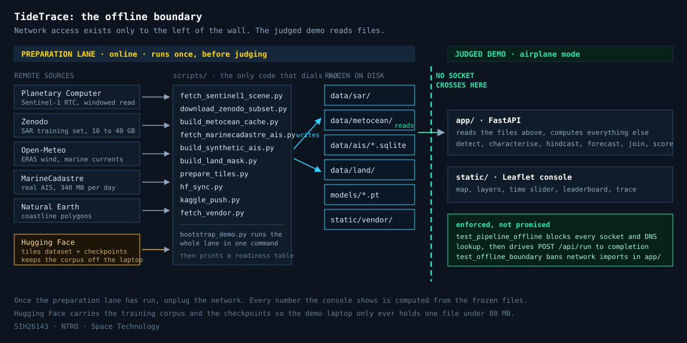
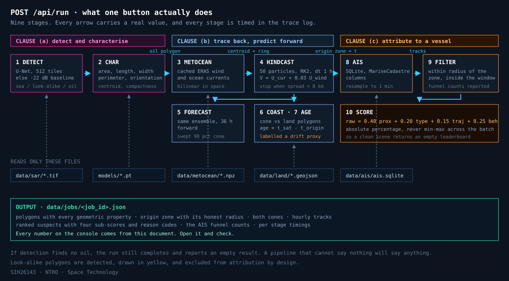

# TideTrace architecture

Two pictures. The first is about trust, the second is about mechanism.

---

## 1. The offline boundary



The single most important structural fact about this system: **network access
exists only in the preparation lane.** Everything under `scripts/` may dial out,
and it runs once, before judging. Everything under `app/` reads files.

`data/` is the interface between the two. Once the preparation lane has run you
can unplug the network, and every number the console shows is still computed
from those frozen files.

This is not a convention anyone has to remember. It is asserted twice:

- `tests/test_pipeline_offline.py` blocks every outbound socket, `getaddrinfo`
  call and `urlopen`, then drives `POST /api/run` to completion.
- `tests/test_offline_boundary.py` parses every module under `app/` and fails if
  one imports a network client, then imports `app.main` and fails if any network
  client ends up in `sys.modules`.

Hugging Face sits in the preparation lane on purpose. The training corpus is
gigabytes and the demo laptop should never hold it; the laptop pulls exactly one
checkpoint file under 80 MB.

---

## 2. What one button does



`POST /api/run` moves a scene through ten numbered stages, each timed and shown
in the trace log. The arrows carry specific values, not vague association: the
oil polygon becomes a seed cloud, the seed cloud becomes an origin zone, the
origin zone becomes an AIS query window.

The three coloured bands map onto the three clauses of the problem statement, so
a judge can point at the part they are asking about.

Two behaviours are worth stating out loud because they are what separate this
from a demo that always produces an answer:

- **A clean scene returns an empty leaderboard.** Scores are absolute
  percentages of the maximum possible, never min-max normalised across whichever
  vessels happen to be present. A relative scale would promote somebody on every
  scene, including one with no slick at all.
- **Look-alikes are detected, drawn, and excluded.** They appear in yellow and
  never reach the attribution stage.

---

## 3. Where training happens

Kaggle is the factory. The laptop is the product.

```
  laptop                Hugging Face                    Kaggle
  ------                ------------                    ------
  hf_sync.py push-code ---> tidetrace-oil-unet/code/ ---> notebook imports app/
                                                             |
                            tidetrace-sar-tiles  <-----------+  prepare-data:
                                    |                           Zenodo -> tiles
                                    |                           streamed so disk
                                    v                           never holds the
                            notebook pulls tiles                archive expanded
                                    |
                                    v
                            train, push on every IoU improvement
                                    |
                            tidetrace-oil-unet/
                              oil_unet_best.pt      (< 80 MB, the demo artefact)
                              last_state.pt         (optimiser state, resume only)
                              training_state.json   (epoch and metrics)
                                    |
  hf_sync.py pull-model <-----------+
```

The checkpointing exists for one reason: a Kaggle session is killed at its time
limit and takes its disk with it. Training pushes the best checkpoint on every
improvement and stops cleanly before the limit, so a continuation session picks
up where the last one stopped. A hard limit becomes a soft one.

The training report always prints the model next to the published -22 dB dark
patch baseline on identical validation tiles. A model that does not beat that
baseline is not worth pitching, and the comparison is there so nobody has to
take it on trust.

---

## Module map

| Layer | Modules | Responsibility |
| --- | --- | --- |
| Entry | `main.py`, `api/` | HTTP surface, static mount, no logic |
| Orchestration | `pipeline.py` | the ten stages, the trace, the warnings |
| Detection | `ml/infer.py`, `ml/fallback.py`, `ml/model.py` | tiled inference, dB baseline, checkpoint IO |
| Geometry | `geo/raster.py`, `geo/geometry.py`, `geo/crs.py`, `geo/tiffio.py` | georeferencing, polygons, local metre frames |
| Physics | `drift/fields.py`, `drift/advection.py`, `drift/cone.py`, `drift/land.py` | metocean, RK2 ensemble, envelopes, coast flag |
| Attribution | `ais/ingest.py`, `ais/interpolate.py`, `ais/filter.py`, `ais/score.py` | store, reconstruction, funnel, scoring |
| Simulation | `ais/synthetic.py` | traffic simulator for uncovered scenes |
| Sync | `hub.py` | Hugging Face, never on the request path |

`torch`, `rasterio`, `scipy`, `pyproj`, `shapely`, `Pillow` and `reportlab` are
all optional. Each has a working fallback, and the UI states which path ran.
